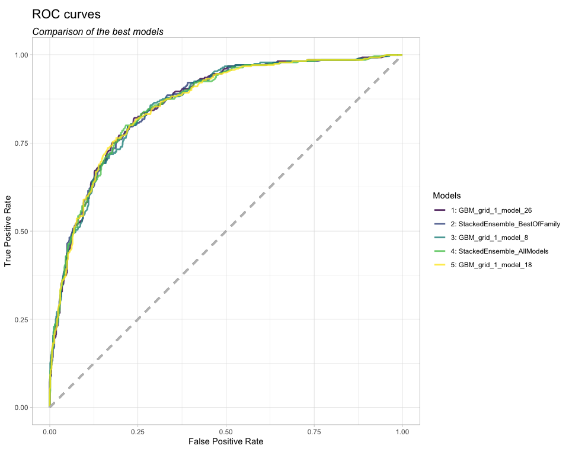
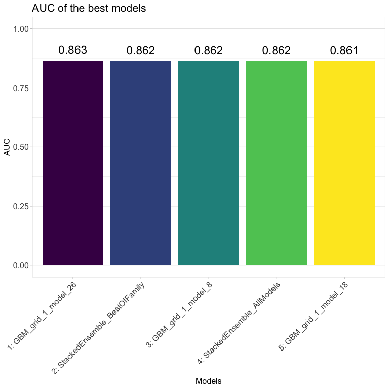
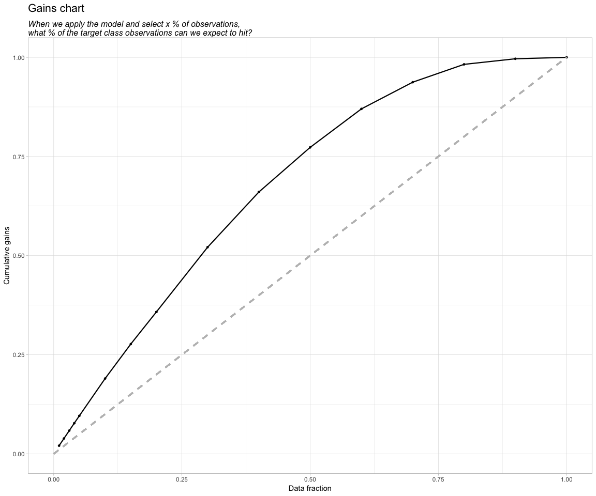
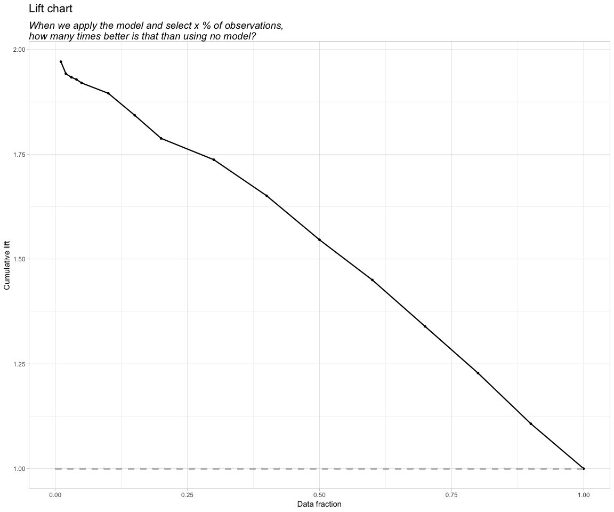
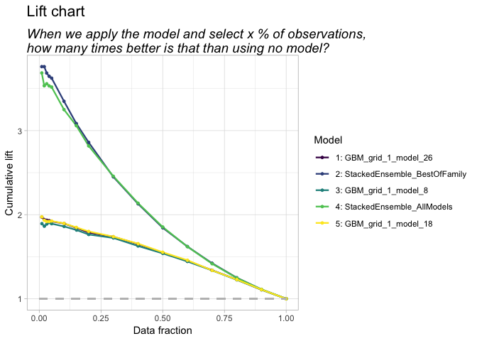
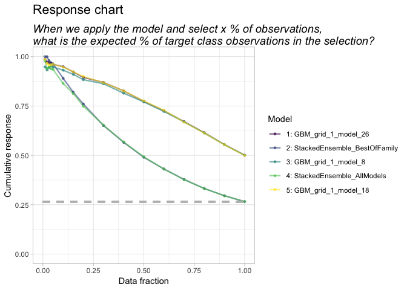
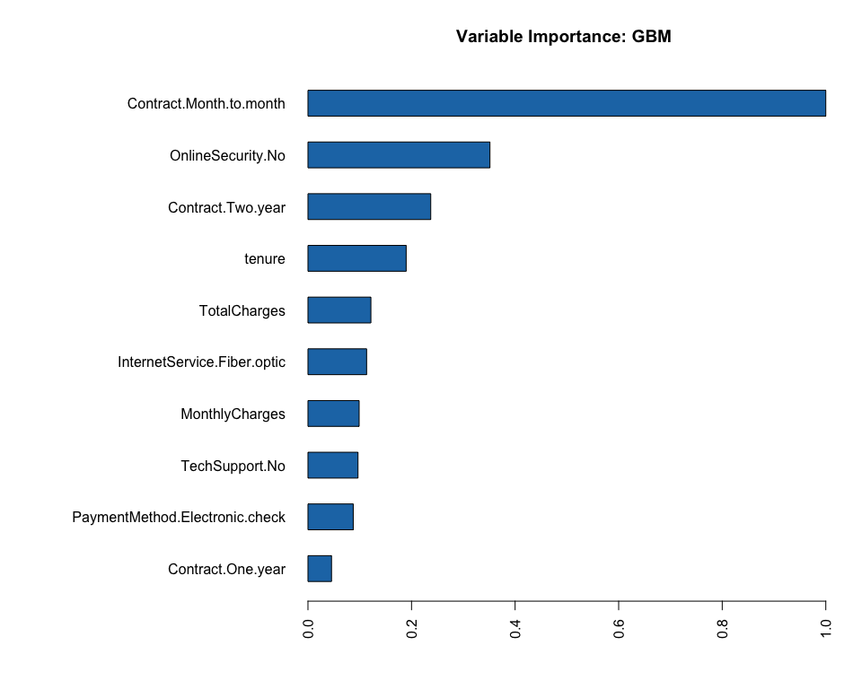
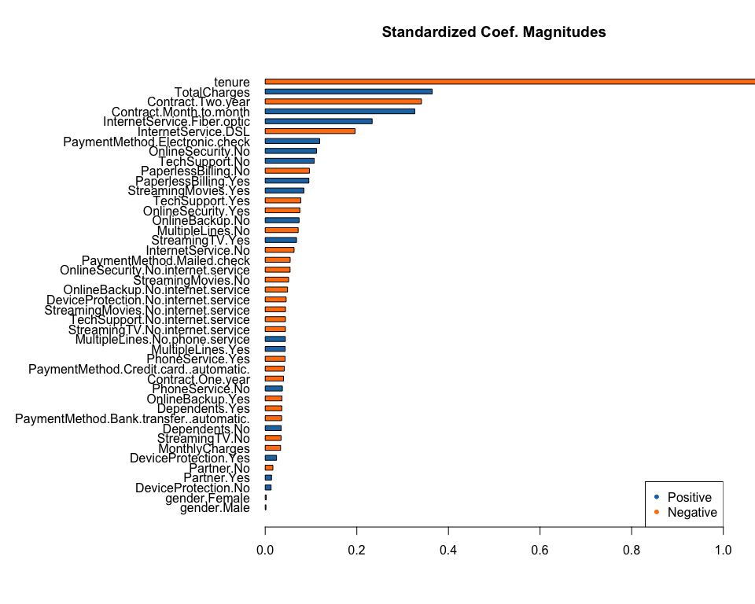
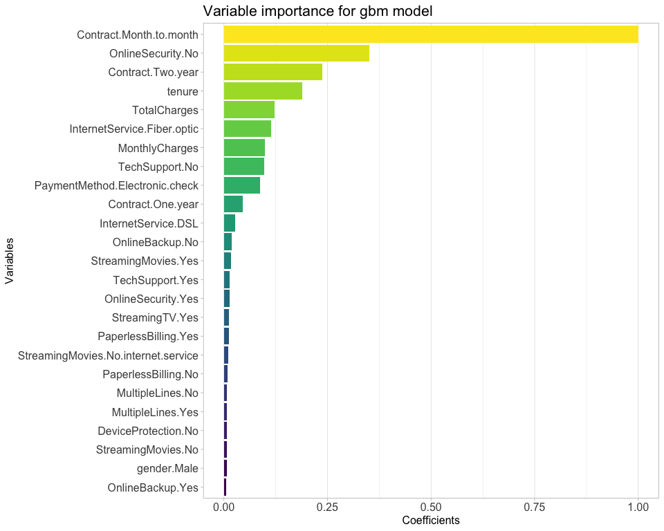

autoMLviz: Functions for plotting H2O AutoML model performance
================

What it does
------------

The package currently contains functions for plotting ROC curves, AUC bar charts, as well as gains, lift and response charts for communicating classification model performance.

Installation
------------

``` r
install.packages("devtools")
library(devtools)

install_github("PeerCHristensen/autoMLviz")
```

Automated machine learning with H2O
-----------------------------------

We'll load some preprocessed sample data and create train, validation and test sets with the caret package before creating an H2OAutoML object, which will contain the performance metrics from multiple models.

``` r
library(tidyverse)
library(caret)
library(h2o)

h2o.init()
```

    ##  Connection successful!
    ## 
    ## R is connected to the H2O cluster: 
    ##     H2O cluster uptime:         4 hours 12 minutes 
    ##     H2O cluster timezone:       Europe/Copenhagen 
    ##     H2O data parsing timezone:  UTC 
    ##     H2O cluster version:        3.22.1.1 
    ##     H2O cluster version age:    2 months and 10 days  
    ##     H2O cluster name:           H2O_started_from_R_peerchristensen_tow661 
    ##     H2O cluster total nodes:    1 
    ##     H2O cluster total memory:   3.25 GB 
    ##     H2O cluster total cores:    8 
    ##     H2O cluster allowed cores:  8 
    ##     H2O cluster healthy:        TRUE 
    ##     H2O Connection ip:          localhost 
    ##     H2O Connection port:        54321 
    ##     H2O Connection proxy:       NA 
    ##     H2O Internal Security:      FALSE 
    ##     H2O API Extensions:         XGBoost, Algos, AutoML, Core V3, Core V4 
    ##     R Version:                  R version 3.5.0 (2018-04-23)

``` r
h2o.no_progress()

df <- read_csv("https://raw.github.com/peerchristensen/churn_prediction/master/telecom_churn_prep.csv") %>%
  mutate_if(is.character,factor)

index <- createDataPartition(df$Churn, p = 0.7, list = FALSE)

train_data     <- df[index, ]
val_test_data  <- df[-index, ]

index2 <- createDataPartition(val_test_data$Churn, p = 0.5, list = FALSE)

valid_data <- val_test_data[-index2, ]
test_data  <- val_test_data[index2, ]

train_hf <- as.h2o(train_data)
valid_hf <- as.h2o(valid_data)
test_hf  <- as.h2o(test_data)

outcome    <- "Churn"
predictors <- setdiff(names(train_hf), outcome)

autoML <- h2o.automl(x = predictors, 
                     y = outcome,
                     training_frame    = train_hf,
                     validation_frame  = valid_hf,
                     leaderboard_frame = test_hf,
                     balance_classes   = TRUE,
                     max_runtime_secs = 1000)
```

Plotting ROC curves
-------------------

First we'll evaluate the performance of the trained models with ROC curves plotted using ggplot2. By default, roc\_curves will compare all models in the AutoML leaderboard. By setting `best = TRUE`, only the best model will be shown. Setting `save_png = TRUE` will save the plot as a picture. The function also returns the relevant data, in case you want to customise the plot. Note that the `test_data` argument must be specified. Furthermore, you can control how many models you would like to include in your plots by setting the `n_models`argument. The default number of models to return is five.

``` r
library(autoMLviz)

roc_curves(autoML, test_data = test_hf)
```



    ## # A tibble: 2,010 x 7
    ##    model_id     algorithm      tpr     fpr model_rank model_id1   model_id2
    ##    <chr>        <chr>        <dbl>   <dbl>      <int> <chr>       <chr>    
    ##  1 1: StackedE… stackeden… 0       0                1 1: Stacked… _NULL    
    ##  2 1: StackedE… stackeden… 0       0                1 1: Stacked… _NULL    
    ##  3 1: StackedE… stackeden… 0.00357 0                1 1: Stacked… _NULL    
    ##  4 1: StackedE… stackeden… 0.00714 0                1 1: Stacked… _NULL    
    ##  5 1: StackedE… stackeden… 0.0107  0                1 1: Stacked… _NULL    
    ##  6 1: StackedE… stackeden… 0.0143  0                1 1: Stacked… _NULL    
    ##  7 1: StackedE… stackeden… 0.0214  0                1 1: Stacked… _NULL    
    ##  8 1: StackedE… stackeden… 0.025   0.00129          1 1: Stacked… _NULL    
    ##  9 1: StackedE… stackeden… 0.0286  0.00129          1 1: Stacked… _NULL    
    ## 10 1: StackedE… stackeden… 0.0321  0.00129          1 1: Stacked… _NULL    
    ## # … with 2,000 more rows

Bar charts comparing area under the curve (AUC)
-----------------------------------------------

``` r
auc_bars(autoML, test_data = test_hf)
```



Gains, Lift and Response charts
-------------------------------

Two functions producing gains, lift and response charts are included. Whereas `lift4gains()` shows the performance of the best model, `lift4gains2()` can be used to compare all models in the AutoML leaderboard.

To get a reference line in the response plot, you need to pass the proportion of target class observations to the `response_ref`argument.

``` r
lift4gains(autoML, response_ref = .265)
```



Note that AutoML objects may return different numbers of quantiles for some models causing some of the lines to appear incomplete.

``` r
lift4gains2(autoML, response_ref = .265)
```



Variable importance
-------------------

With autoMLviz, you can also plot variable importannce for the best model. `varImp_plot()` calls the standard `h2o` plotting function, whereas `varImp_ggplot()` creates the plot using ggplot and a theme that is consistent with the above figures. If the best model is an ensemble model, both functions will create two plots. One showing the model importance, and the second showing variable importance for the most important model within the ensemble.

``` r
varImp_plot(autoML)
```

    ## [1] "Ensemble model: Plotting Model importance and Variable importances of model with highest importance"



``` r
varImp_ggplot(autoML)
```

    ## [1] "Ensemble model: Plotting Model importance and Variable importances of model with highest importance"


